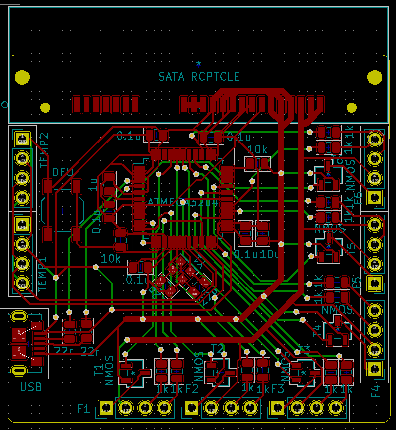
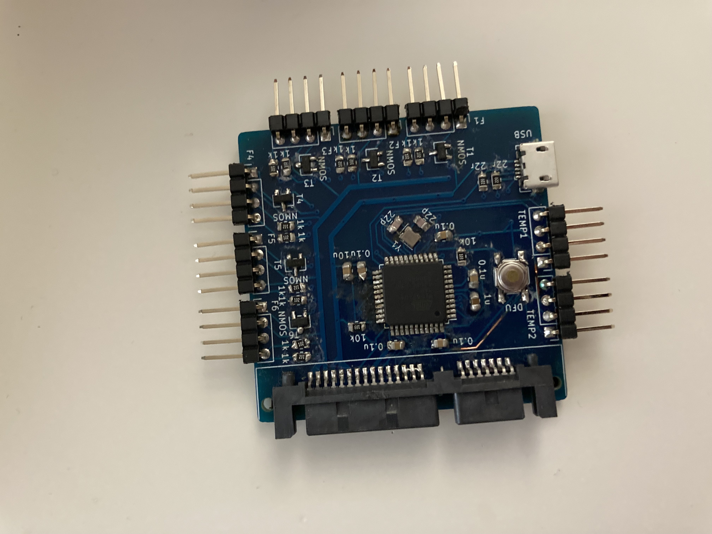

# FanController8
Disclaimer: FanController8 is so named because Atmel studio had a bug which caused my project files to corrupt periodically. The eighth version was the final one that was necessary to finish the project.

## Overview
I'm including this project on my Github because, although the board and code is messier than what I could produce today, this fan controller is probably the project I am the most proud of. This fan controller took me longer to get right than any project I've worked on since. Possibly due to inexperience, or possibly due to poor selection of components, I spent close to 4 hours a day on this project for the better part of a Summer (all of my evenings). First on the hardware, then the GUI, and then integrating it all together, I would guess I spent close to 400 hours on this project. I consider the completion of this project to be a matter of personal pride and a great demonstration of my perseverance. I thought I'd give up when I couldn't measure the fan speed accurately, or when the GUI wouldn't communicate with the fan controller, or when Atmel Studio corrupted my project files (without me knowing), but every time I woke up the next morning ready to keep working.

A fan controller, for the uninitiated, is used to power fans in a computer such that they spin at the correct speed depending on the temperatures inside the computer, and the noise level which the user can tolerate. A good fan controller is reliable, and easy to control via good software on the user's computer.

I've been in college for a couple of years at the time of writing this, and when I left for college I switched from a desktop to a laptop. But for the couple of years I got to use this fan controller in my computer (after I got it fully working) it was the most seamless, consistent, and reliable experience I've had with a PC fan controller, and when I get another desktop computer in a few years, I look forward to digging out my old hard drive and scraping out the GUI program files so that I can continue using it. Every commercial competitor, like the Corsair Commander pro, that I have tried has hardware which doesn't last, software which doesn't work, or a line of communication between the two reminiscent of a divorced couple... who are hard of hearing.

## Technical details (Hardware and Firmware)
The fan controller uses an Atmega32u4 to produce PWM signals to control the speed of the fans plugged into it. This was the microcontroller I was most comfortable with at the time (and the first I ever learned how to program) but was probably underpowered for what I was asking it to do, considering it only has two 16 bit timers. With only two available timers with a high enough resolution, and only three output compare channels on each, I was limited to just six fans, and even that was difficult. Another difficulty with the Atmega32u4 was it's clock speed of 16Mhz. This wouldn't have been a problem had it not been the case that if the fan was switched on and off at a frequency within the human range of hearing, it was loud and annoying. This meant that, for all intents and purposes, I could only have a PWM period of ~800 clocks before I dipped into the 20Khz range characteristic of human hearing. This meant I had to be creative with my interrupt service routines and to minimize the cycles wasted switching the fans on and off.

I used the MCU's analog comparator to measure the fan speeds from the built in Tachometers in PC fans. This process took a long time to tune but once I got it working was a relatively consistent part of the firmware (other parts took much longer to work out some hidden bugs).
I used simple algebra techniques to calculate the correect fan speed for a given temperature given the data points provided by the user and I stored all of those data points in the EEPROM on board the Atmega32u4.
I used LUFA (lightweight USB framework for Atmel) to produce a CDC driver which I used to communicate with the host computer.
As for the actual circuit board itself, I used SATA power to power the device (as is consistent with some similar PC components which use Molex or Sata). I used discrete transistors with PWM on the gate to control three pin (non-pwm) fans, and PWM directly on the PWM pin of 4 pin fans.

The circuit board was relatively simple to design, and the main concern was making sure that it could provide up to an amp of current to each fan. This was relatively simple since there was no real size constraint and there wasn't a lot of hardware to put on the board.

## Technical details (GUI)

The GUI for the project contains charts with temperature data about the computer (some provided by temperature headers on the fan controller itself and some by the system using OpenHardwareLib and a C# to managed C++ to regular C++ DLL hack). The GUI also contained graphs where data points could be added, removed, and moved around to adjust the fan curve for the fans. You could also select which temperataure to base the fan speed on for each fan in the GUI. The image below was taken of the GUI running on my laptop without the fan controller plugged in (hence missing fan speeds and temperature data), since I do not have it with me when I am publishing this.

I wish I could provide a more in depth overview of my decision making process, and the process of producing the device, but it's been a few years, and I've honestly forgotten so much.

Please pardon the solder job, I've improved significantly since this project!

