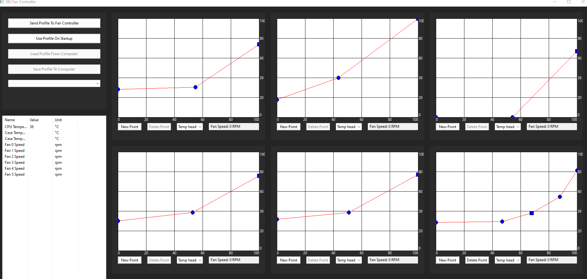

# FanController8
Disclaimer: FanController8 is so named because Atmel studio had a bug which caused my project files to corrupt periodically. The eighth version was the final one that was necessary to finish the project.

Every single PC fan controller sucks, so I made my own. In my opinion, both the software and hardware currently available commericially are terrible, and so I decided to redo both. I designed a small circuit board which uses PWM to control fans to a certain speed (measured using an analog comparator), retrieves the temperature of the case from two onboard fan headers, and communicate with a computer via an internal USB header.

This respository contains the code and PCB files for the hardware side of the project, as well as the code for the GUI on the computer side.

This GUI contains charts with temperature data about the computer (some provided by temperature headers on the fan controller itself and some by the system using OpenHardwareLib and a C# to managed C++ to regular C++ DLL hack). The GUI also contained graphs where data points could be added, removed, and moved around to adjust the fan curve for the fans. You could also select which temperataure to base the fan speed on for each fan in the GUI. The image below was taken of the GUI running on my laptop without the fan controller plugged in (hence missing fan speeds and temperature data), since I do not have it with me when I am publishing this.

With this project, I gained experience with a wide variety of microcontroller peripherals (I2C, GPIO, Comparators, Timers/PWM, USB, etc). In addition, I improved my  knowledge of electronics, my PCB design skills, and my c and c++ programming ability.

In addition to technical experience, this project taught me a lot about managing limited resources (specifically I used two 16 bit timers to control 6 different fans), as well as the importance of prototyping, considering my initial circuit layout was incorrect, and I only discovered it after ordering the first round of circuit boards while I was testing the discrete components on their own.

Finally, this fan controller took me longer to get right than any project I've worked on since. Possibly due to inexperience, or possibly due to poor selection of components, I spent close to 4 hours a day on this project for the better part of a Summer (all of my evenings). First on the hardware, then the GUI, and then integrating it all together, I would guess I spent close to 300 hours on this project. I consider the completion of this project to be a matter of personal pride and a great demonstration of my perseverance. I thought I'd give up when I couldn't measure the fan speed accurately, or when the GUI wouldn't communicate with the fan controller, or when Atmel Studio corrupted my project files (without me knowing), but every time I woke up the next morning ready to keep working.

I've been in college for a couple of years at the time of writing this, and when I left for college I switched from a desktop to a laptop. But for the couple of years I got to use this fan controller in my computer (after I got it fully working) it was the most seamless, consistent, and reliable experience I've had with a PC fan controller, and when I get another desktop computer in a few years, I look forward to digging out my old hard drive and scraping out the GUI program files so that I can continue using it. 

I wish I could provide a more in depth overview of my decision making process, and the process of producing the device, but it's been a few years, and I've honestly forgotten so much.

Please pardon the solder job, I've improved significantly since this project!

